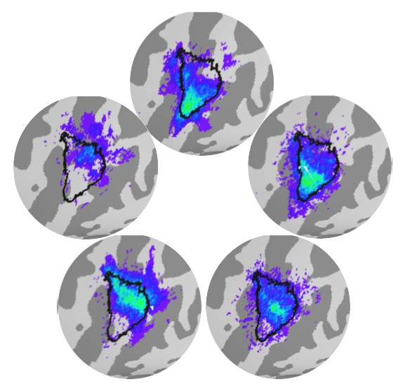
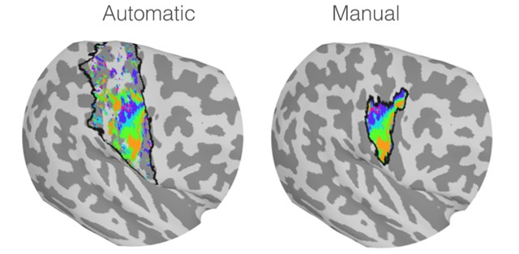

# digitAtlas

Individual hot-encoded and group-level probabilistic maps of digit dominance. For both volumetric and surface based analysis pipelines.

# Masking Types

In the dataset there are two versions of each set of maps labelled *automatic* and *manual*. The difference in a single participant's maps can be seen below where the boundary of the masks used are represented as the black borders on the cortical surface. Automatic masking is based on all the Brodmann Areas associated with S1 (i.e. 3b, 3a, 1, 2). Manual masking is a hand-drawn area where the phase and coherence of the fMRI data the maps were based on was high over a large area, this leads to a single contiguous area of activation rather than the many smaller areas of activation see in the automatic masking.  

# Citation
Please cite the following paper if this code is of any benefit to yourself. 
> O’Neill G.C., Sengupta A., Asghar M., Barratt E.L., Besle J., Schluppeck D., Francis S.T., Sanchez Panchuelo R. M., (20XX) A probabilistic atlas of finger dominance in the primary somatosensory cortex